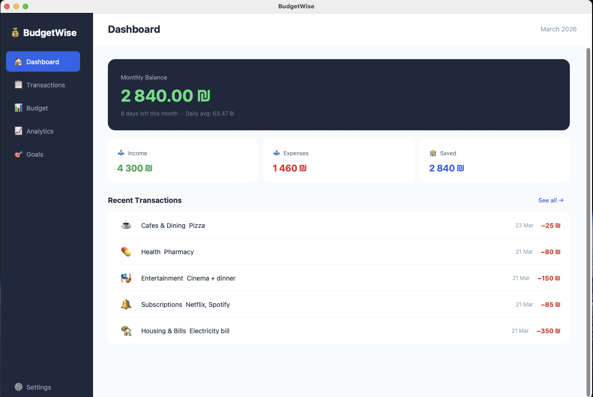
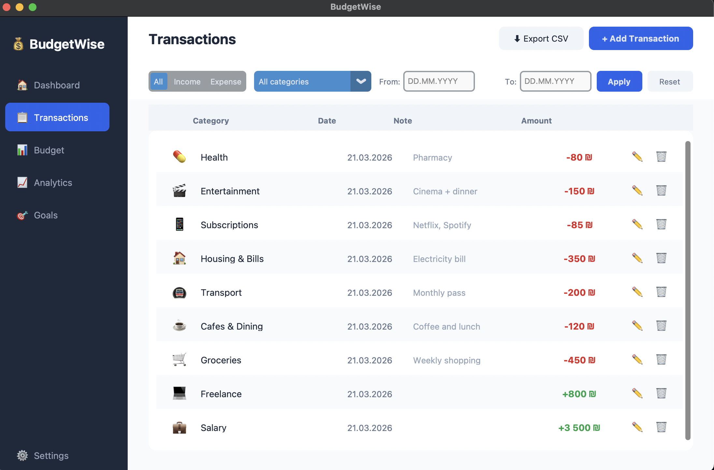
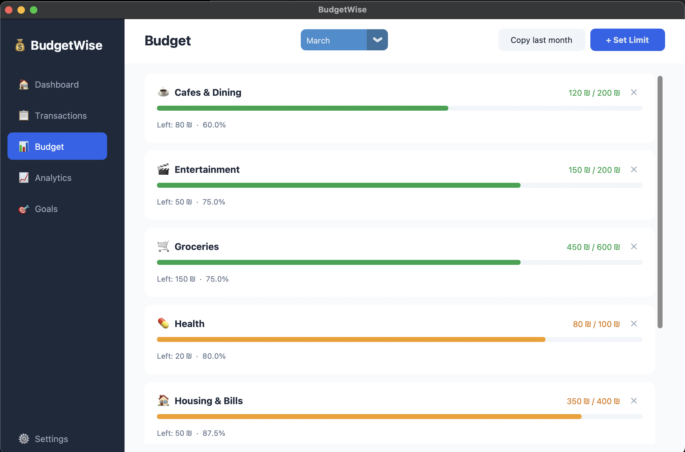
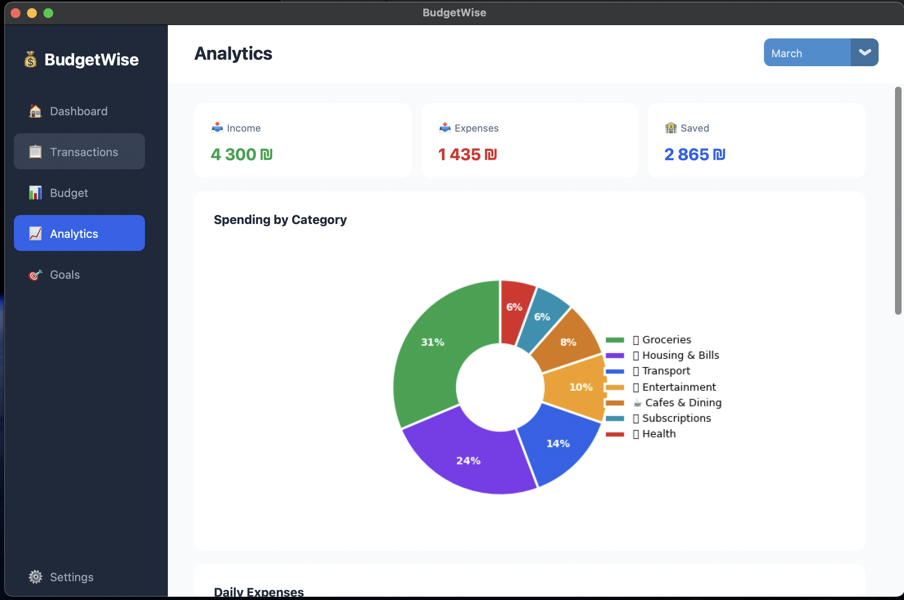
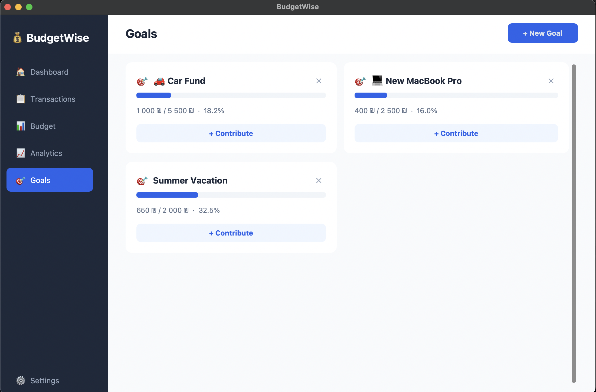
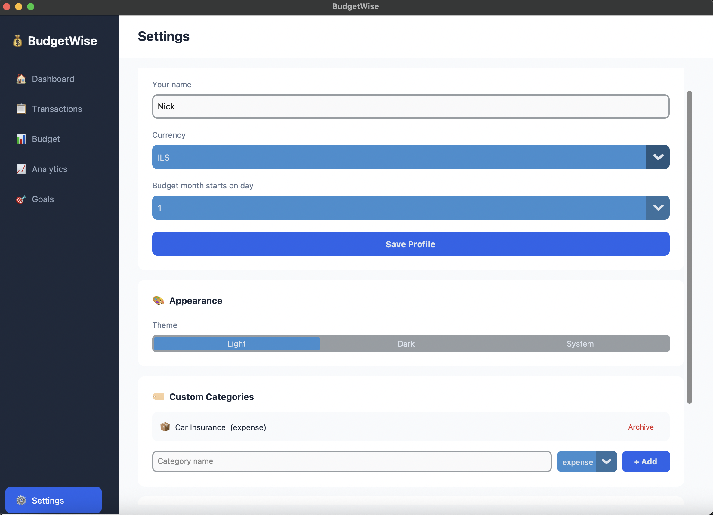
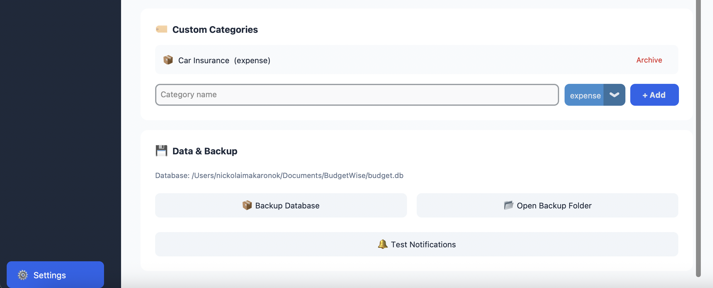

# 💰 BudgetWise Desktop

> A personal finance desktop app for macOS built entirely in Python.
> Track income and expenses, set budget limits, manage savings goals, and visualize spending analytics.

**Version:** 1.1.0
**Platform:** macOS (Apple Silicon + Intel)
**Language:** Python 3.12
**UI:** CustomTkinter + Matplotlib

---

## 📋 Table of Contents

- [What it does](#what-it-does)
- [Requirements](#requirements)
- [Installation](#installation)
- [Running the app](#running-the-app)
- [Running tests](#running-tests)
- [Building the .app](#building-the-app)
- [Project structure](#project-structure)
- [Tech stack](#tech-stack)
- [Key rules](#key-rules)
- [Changelog](#changelog)

---

## What it does

| Page | Features |
|---|---|
| **Dashboard** | Monthly balance, income/expenses cards, recent transactions |
| **Transactions** | Add / edit / delete, filters by type + category + date, CSV export |
| **Budget** | Set monthly limits per category, progress bars, warning/danger colors |
| **Analytics** | Pie chart by category, bar chart by day, breakdown table |
| **Goals** | Savings goals with progress bars, contribute, auto-complete |
| **Settings** | Currency, theme (Light/Dark/System), custom categories, DB backup |

---


## Screenshots

### Dashboard


### Transactions


### Budget


### Analytics


### Goals


### Settings1


### Settings2


## Requirements

### System
- macOS 10.13 or later (tested on macOS 15 Sequoia, Apple Silicon M-series)
- Python 3.12 (via Anaconda or standalone)

### Python environment
- All dependencies are listed in `requirements.txt`
- Use a **virtual environment** (`.venv`) — do NOT install into system/conda Python

### IDE
- **PyCharm** (recommended — auto-activates `.venv`, runs tests with one click)
- **VSCode** (works, requires manual interpreter selection)

---

## Installation

### Step 1 — Clone or download the project

```bash
cd ~/Documents/DevelopAndProgramming
# if using git:
git clone https://github.com/nickolaimakaronok/budgetwise.git
cd budgetwise
```

### Step 2 — Create virtual environment

```bash
python3 -m venv .venv
```

### Step 3 — Activate virtual environment

```bash
source .venv/bin/activate
```

> You should see `(.venv)` at the start of your terminal prompt.
> You need to do this every time you open a new terminal window.
> In PyCharm — this happens automatically.

### Step 4 — Install dependencies

```bash
pip install -r requirements.txt
```

This installs:

| Package | Version | Purpose |
|---|---|---|
| customtkinter | 5.2.2 | Modern UI widgets |
| matplotlib | 3.9.2 | Charts and graphs |
| peewee | 3.17.6 | SQLite ORM |
| numpy | 1.26.4 | Required by matplotlib |
| plyer | 2.1.0 | macOS system notifications |
| tkcalendar | 1.6.1 | Date picker widget |
| Pillow | 10.4.0 | Image support |
| pytest | 8.3.3 | Test runner |
| pyinstaller | 6.10.0 | Build .app bundle |

> ⚠️ numpy must be version **1.26.4** — newer versions (2.x) conflict with PyInstaller + Anaconda.

### Step 5 — Initialize the database

```bash
python main.py
```

On first run this automatically:
- Creates `~/Documents/BudgetWise/budget.db`
- Creates all tables
- Seeds 18 default categories (Groceries, Salary, Transport, etc.)

---

## Running the app

### During development (fastest)

```bash
source .venv/bin/activate
python main.py
```

### From PyCharm

1. Open the `budgetwise/` folder in PyCharm
2. PyCharm detects `.venv` automatically — click OK if prompted
3. Open `main.py`
4. Click the green ▶️ Run button

### As .app bundle (production)

```bash
open dist/BudgetWise.app
```

Or double-click `BudgetWise.app` in Finder.

> If macOS blocks it: right-click → Open → Open (first time only)
> Or run: `xattr -cr dist/BudgetWise.app && open dist/BudgetWise.app`

---

## Running tests

```bash
source .venv/bin/activate
python -m pytest tests/ -v
```

Expected output: **124 passed** across two test files.

| File | Tests | What it covers |
|---|---|---|
| `tests/test_formatters.py` | 18 | Money formatting, date parsing, currency symbols |
| `tests/test_services.py` | 20 | Transaction CRUD, budget status, analytics |
| `tests/test_full.py` | 86 | Full integration: models, services, edge cases |

> Always use `python -m pytest` not just `pytest` — the latter may use the wrong Python interpreter.

---

## Building the .app

The app is built using PyInstaller into a standalone macOS `.app` bundle.
Users don't need Python installed to run it.

### Prerequisites

Make sure `.venv` is active and numpy 1.26.4 is installed:

```bash
source .venv/bin/activate
python -c "import numpy; print(numpy.__version__)"  # should print 1.26.4
```

### Build

```bash
rm -rf build/ dist/
./build.sh
```

Build takes 2-5 minutes. Output is at `dist/BudgetWise.app`.

### Install to Applications folder

```bash
xattr -cr dist/BudgetWise.app
cp -r dist/BudgetWise.app /Applications/BudgetWise.app
open /Applications/BudgetWise.app
```

### What `build.sh` does

```bash
#!/bin/bash
# Strips conda from PATH to prevent numpy conflict
# Runs PyInstaller with --noconfirm --clean
# Packages into BudgetWise.app with icon + metadata
```

> ⚠️ If you move the project folder, update the path in `BudgetWise.spec` under `datas`:
> ```python
> ('/Users/YOU/path/to/budgetwise/.venv/lib/python3.12/site-packages/customtkinter', 'customtkinter/'),
> ```

---

## Project structure

```
budgetwise/
│
├── main.py                      # Entry point — run this to start the app
├── requirements.txt             # All Python dependencies
├── BudgetWise.spec              # PyInstaller build config
├── build.sh                     # Build script for .app
├── create_icon.py               # Generates assets/BudgetWise.icns
│
├── db/
│   ├── database.py              # SQLite connection via Peewee
│   └── migrations.py            # Creates tables + seeds 18 default categories
│
├── models/
│   └── models.py                # Data models: User, Transaction, Category, Budget, Goal
│
├── services/                    # Business logic — UI never touches DB directly
│   ├── transaction_service.py   # add / get / update / delete / get_totals
│   ├── budget_service.py        # set_budget / get_budget_status / copy_from_prev_month
│   └── analytics_service.py     # get_balance / get_spending_by_category / get_month_summary
│
├── ui/
│   ├── app.py                   # Main window with sidebar navigation
│   └── pages/
│       ├── dashboard.py         # Balance card + stat cards + recent transactions
│       ├── transactions.py      # Table + filters + add/edit/delete + CSV export
│       ├── budget.py            # Budget limits with progress bars
│       ├── analytics.py         # Pie chart + bar chart + breakdown table
│       ├── goals.py             # Savings goals with progress bars
│       ├── settings.py          # Profile, theme, categories, backup
│       └── placeholder.py       # Temporary placeholder for unfinished pages
│
├── utils/
│   ├── constants.py             # APP_NAME, colors, fonts, nav items
│   ├── formatters.py            # format_money, parse_money, format_date, etc.
│   └── notifications.py         # Background thread for budget limit alerts
│
├── assets/
│   └── BudgetWise.icns          # App icon (generated by create_icon.py)
│
└── tests/
    ├── test_formatters.py        # Unit tests for formatters
    ├── test_services.py          # Unit tests for all three services
    └── test_full.py              # Full integration test suite (124 tests)
```

### Data flow

```
User clicks in UI
      ↓
ui/pages/*.py          — display only, no DB access
      ↓
services/*.py          — all business logic and calculations
      ↓
models/models.py       — Peewee ORM models
      ↓
~/Documents/BudgetWise/budget.db   — SQLite file on disk
```

---

## Tech stack

| Layer | Technology | Why |
|---|---|---|
| UI | CustomTkinter | Pure Python, modern look, dark/light theme, no JS |
| Charts | Matplotlib + FigureCanvasTkAgg | Embeds directly into CustomTkinter frames |
| Database | SQLite (built into Python) | Zero config, single file, ACID transactions |
| ORM | Peewee | Simplest Python ORM, one file, no boilerplate |
| Notifications | plyer | One-line macOS system notifications |
| Build | PyInstaller | Packages everything into a standalone .app |
| Tests | pytest | Standard Python test runner |

### Database location

```
~/Documents/BudgetWise/budget.db
```

Both `python main.py` and `dist/BudgetWise.app` use the **same database file**.
Backups are saved to `~/Documents/BudgetWise/backups/`.

---

## Key rules

### Money is always stored in cents (integer)

```python
# CORRECT — store as integer cents
amount_cents = round(150.50 * 100)  # → 15050

# WRONG — never use float for money
amount = 150.50  # ❌ floating point errors
```

### UI never touches the database directly

```python
# CORRECT
from services.transaction_service import add_transaction
add_transaction(user, "expense", 15050, category=cat)

# WRONG
Transaction.create(...)  # ❌ never do this from UI code
```

### Always activate .venv before running anything

```bash
source .venv/bin/activate   # every new terminal session
python main.py
python -m pytest tests/ -v
python -m PyInstaller --noconfirm BudgetWise.spec
```

---

## Changelog

### v1.1.0 (March 2026)
- ✅ Edit transactions — pre-filled dialog with current values
- ✅ Filters in Transactions page — by type, category, date range
- ✅ Export to CSV — exports current filtered view
- ✅ Background budget notifications via plyer
- ✅ Analytics page month selector
- ✅ Budget page month selector
- ✅ Shared database path (python main.py and .app use same file)
- ✅ Downgraded numpy to 1.26.4 for PyInstaller compatibility

### v1.0.0 (March 2026)
- ✅ Dashboard with monthly balance and recent transactions
- ✅ Transactions — add and delete
- ✅ Budget — set limits, progress bars, warning/danger colors
- ✅ Analytics — pie chart, bar chart, category breakdown
- ✅ Goals — savings goals with progress bars and contributions
- ✅ Settings — currency, theme, custom categories, DB backup
- ✅ PyInstaller .app build for macOS
- ✅ 124 automated tests

---

## Common issues

### `ModuleNotFoundError: No module named 'peewee'`
You're using the system Python instead of `.venv`. Run:
```bash
source .venv/bin/activate
python main.py
```

### App doesn't open after double-click
macOS is blocking an unsigned app. Run:
```bash
xattr -cr dist/BudgetWise.app
open dist/BudgetWise.app
```

### Analytics doesn't show in .app
Make sure numpy 1.26.4 is installed in `.venv` (not conda):
```bash
source .venv/bin/activate
pip install numpy==1.26.4 --force-reinstall
rm -rf build/ dist/
./build.sh
```

### PyInstaller asks "Continue? (y/N)"
Use the `--noconfirm` flag or use `./build.sh` which handles this automatically.

---

*Built with Python 3.12 · CustomTkinter · SQLite · Peewee · Matplotlib · PyInstaller*
